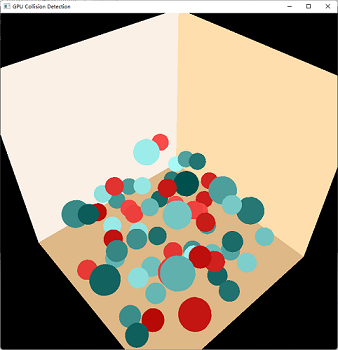

# 基于GPU的碰撞检测

孙梓健  2017010428  软81班

## 1 实验目的

+ 掌握球体之间的碰撞检测算法
+ 了解基于GPU的编程

## 2 实验环境

+ 操作系统: Windows 11 10.0.22000
+ 编译环境: Visual Studio 2019 (MSVC + OpenCL)
+ 显卡型号: Intel(R) OpenCL HD Graphics 630
+ 附加组件
    + freeglut: 3.2.1
    + Intel SDK for OpenCL: 2020.3.494
    + CUDA: 11.5

## 3 环境配置

1. 编译freeglut，将文件夹放在解决方案目录下
2. 下载并安装OpenCL，添加系统环境变量INTELOCLSDKROOT为OpenCL安装目录的sdk文件夹
3. 添加系统环境变量INTELOCLPATH为"...\sdk\bin\x86"和"...\sdk\bin\x64"
4. 添加环境变量CUDA_PATH为"...\NVIDIA GPU Computing Toolkit\CUDA\v11.5"
5. 在项目中更改配置为Release，平台为x64
6. 添加附加包含目录
    + $(INTELOCLSDKROOT)include
    + $(SolutionDir)freeglut\include
    + $(CUDA_PATH)\include
7. 添加附加库目录
    + $(CUDA_PATH)\lib\x64
    + $(INTELOCLSDKROOT)lib\x64
    + $(SolutionDir)freeglut\build\lib\Release
8. 添加附加依赖项: OpenCL.lib

## 4 项目结构

### 4.1 Geometry

处理一些几何形状和信息

+ Vector3D: 三维点
+ Sphere: 球体
+ Color: 颜色信息
+ Spheres: 存储所有球体的坐标、半径、速度等参数

### 4.2 OpenCL

OpenCL相关的处理器和工具类

+ OpenCLEntity: OpenCL Kernel的执行对象
+ utils: 日志信息和错误信息处理

### 4.3 View

+ Camera: 相机类

### 4.4 主程序

+ CollisionDetection: 程序的主入口，包括OpenGL图形的初始化和绘制，以及OpenCL的核心功能

### 4.5 OpenCL Kernel

+ Template.cl: 碰撞检测算法实现

## 5 项目流程

1. 在内存中创建存储小球信息的变量
2. 初始化OpenCL环境
3. 将内存信息赋给OpenCL kernel (转移到GPU)
4. 定时调用kernel，更新小球的位置和速度
5. OpenGL绘制小球的图形

## 6 实验结果

### 6.1 效果图

### 6.2 性能分析

在小球数量不同时，测量当小球位置和速度更新200次时所花费的时间(s)

| 小球数量 | t1 | t2 | t3 | 均值 |
| --- | --- | --- | --- | --- |
| 50 | 5.252 | 5.564 | 5.402 | 5.406 |
| 100 | 5.603 | 4.635 | 5.233 | 5.157 |
| 500 | 4.618 | 4.674 | 4.812 | 4.701 |
| 1000 | 4.723 | 4.649 | 4.628 | 4.667 |
| 2000 | 5.363 | 5.334 | 5.235 | 5.307 |
| 3000 | 7.032 | 7.120 | 7.084 | 7.079 |
| 5000 | 13.045 | 13.028 | 13.071 | 13.048 |

可以看出，小球数量在2000以下时，制约程序效率的原因并不在数量，而是OpenCL框架、数据预处理等方面；而在数量上升到2000以后，耗时开始增加，此时制约效率的因素在于小球数量。

## 7 参考资料

OpenCL的部分代码属于固定流程，故直接引用加以修改

+ https://www.cnblogs.com/leiben/archive/2012/06/05/2536508.html
+ https://zhuanlan.zhihu.com/p/104535854